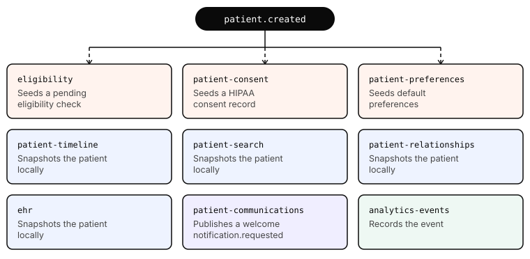
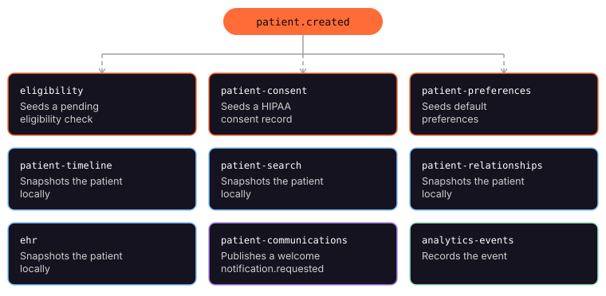
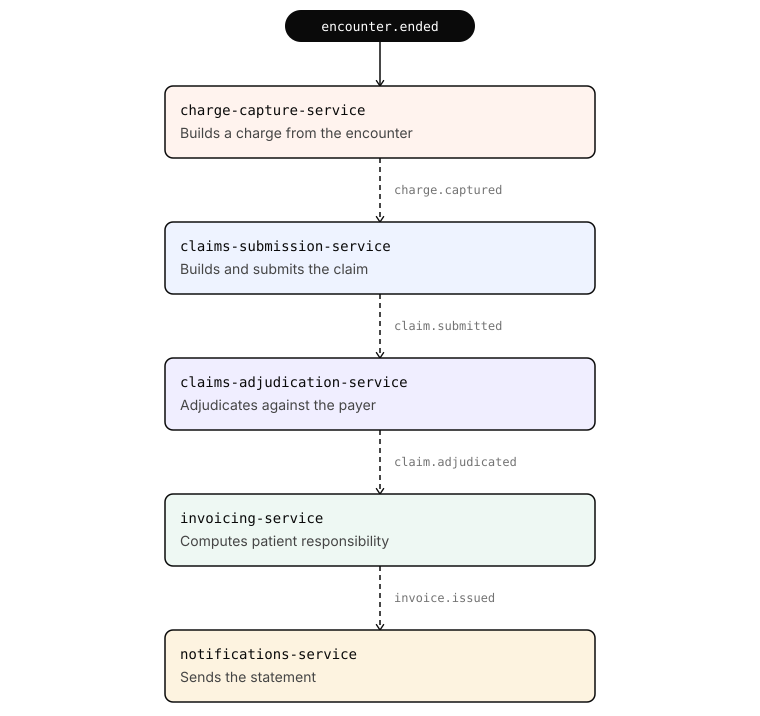
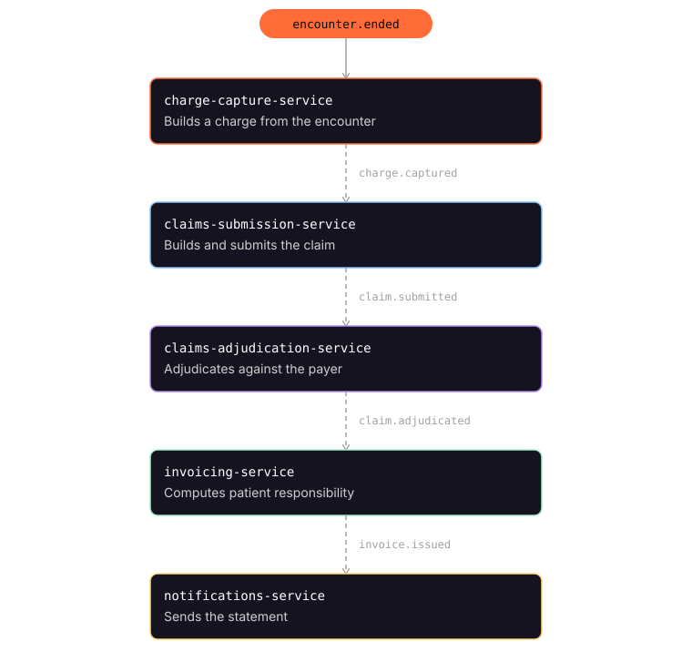

Everything on this page is implemented and traceable in code — these are not planned flows. 49 services have at least one real Kafka handler that writes to its own database or publishes a follow-up event, roughly 90 handler bodies in total, and 44 services make live HTTP calls to peers inside their `POST` handlers.

## Flows that run end to end

### Patient onboarding

Creating one patient fans out to **nine subscribers** of `patient.created`, in four kinds of reaction:

One `POST` produces cascading writes across five domains. It is the shortest way to show why a single endpoint's contract is not a local concern.

### Encounter to cash

The revenue cycle runs as an event chain, each link a different service and a different domain:

Then payment closes the loop. `POST /api/payments/pay` publishes `invoice.paid`, and six services react: the invoice is marked paid, the statement timestamped, any open collections case closed, a receipt sent, the event recorded for analytics, and revenue posted to the external ERP's general ledger.

### Device alerting

`device.reading` (24 partitions — this is the high-volume path) → `device-alerts-service` checks thresholds → publishes `device.alert.triggered` → `care-teams-service` opens a case, `notifications-service` pages the on-call clinician, `remote-monitoring-service` retains the alert.

### Appointment lifecycle

`appointment.booked` schedules a reminder, marks the slot booked, blocks provider time, allocates a room, and confirms to the patient — five services from one event. `appointment.cancelled` reverses it and offers the freed slot to the next person on the waitlist.

### Patient merge

The hardest one, and the most useful. `patient.merged` forces **seven services** — `ehr`, `patient-timeline`, `patient-search`, `patient-relationships`, `billing`, `claims-submission`, `audit-log` — to repoint their local snapshots at the surviving patient id. Every service that cached patient data now has to prove it handled the merge.

### Cross-organization ERP integration

`erp-bridge-service` translates seven healthcare events into HTTP calls against ERP microservices in an entirely separate GitHub org (`buildwithtalia/erp-*`):

| Event | ERP call |
|---|---|
| `invoice.paid` | `erp-accounting` — revenue posting |
| `claim.adjudicated` | `erp-accounting` — insurance receivable |
| `encounter.ended` | `erp-payroll` — provider credit |
| `prescription.issued` | `erp-inventory` — drug SKU decrement |
| `device.reading` | `erp-supply-chain` — sampled telemetry |
| `patient.merged` | `erp-billing` — reconcile merge |
| `identity.user.created` | `erp-hr` — staff provisioning |

Traffic goes both ways: three services validate against ERP inline on create (`providers-service` checks `employee_id` against `erp-hr`, `equipment-service` checks a `sku`, `sterile-supply-service` checks a `vendor_id`), and `erp-hr` runs its own Kafka consumer against healthcare's `identity.user.created`.

Every outbound call is retried and circuit-broken. Failures publish `erp.posting.failed` and the healthcare transaction proceeds regardless — the ERP is never in the critical path.

## What the platform is good for exercising

<CardGroup cols={2}>
  <Card title="Spec coverage at scale" icon="duotone file-code">
    One of 101 services has an OpenAPI spec. The other 100 are Flask apps that emit no spec at all. That gap is the realistic starting condition for anything about API discovery, spec generation, or governance.
  </Card>
  <Card title="Blast-radius analysis" icon="duotone explosion">
    285 declared HTTP edges and 107 event subscriptions, all declared in `service.yaml` files and `registry.yaml`. Changing `patients-service` touches 36 direct callers before second-order effects.
  </Card>
  <Card title="Event-driven testing" icon="duotone bolt">
    Assertions that span services: publish one event, verify writes in five databases. Chains are deep enough that ordering and idempotency actually matter.
  </Card>
  <Card title="Contract drift" icon="duotone arrows-split-up-and-left">
    Specs here are hand-written, and nothing verifies them against the Flask routes. A developer can add an endpoint and the spec goes quietly stale — the normal condition in most estates, reproduced faithfully.
  </Card>
  <Card title="Cross-org integration" icon="duotone right-left">
    Two GitHub orgs, two teams' conventions, async and sync in both directions. Federation problems that a single-repo demo cannot pose.
  </Card>
  <Card title="Fleet-wide tooling" icon="duotone layer-group">
    100 services generated from one template means anything that works on one should work on all of them — which makes it easy to show a tool scaling, and easy to catch one that does not.
  </Card>
</CardGroup>

## Known rough edges

Worth knowing before building a demo on top of any of this:

- **There is no working API gateway.** The `healthcare-api-gateway` repo exists, but `cmd/main.go` is 28 lines that register `/health` and `/ready` and proxy nothing. Services are addressed directly on their own ports; there is no single base URL in front of the fleet. Architecture diagrams in the source repos show a gateway — treat that as intent, not deployment.
- **Auth is disabled in local development** via `AUTH_DISABLED=1`. The JWT scope-checking path exists and is enforced when that flag is off, but the default local experience does not exercise it.
- **`all` is not a realistic stack.** Running 101 services at once needs 40 GB+ of RAM. Compose a subset instead — see [Run it locally](/run-locally).
